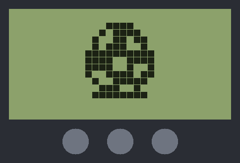

# tamarecomp

**A static-recompilation toolkit for the Tamagotchi P1 — and, as far as we can tell, the first static recompiler ever built for a 4-bit CPU.**

<p align="center">
  
</p>

<p align="center"><em>Twenty seconds after power-on. Every instruction on that
screen came out of a C compiler, not an interpreter.</em></p>

The original 1996 Tamagotchi runs an **Epson E0C6S46**: a 4-bit microcontroller
with a 12-bit instruction word, 6144 words of mask ROM, 4-bit data, and a
320-segment LCD driver welded to the side of it. The entire machine is 9,216
bytes of instruction space and a handful of fixed-function peripherals.

That shape is close to ideal for static recompilation. There is one CPU. There
is no cartridge, no bank switching beyond a single bank bit, no self-modifying
code (the ROM is mask ROM — it *cannot* be written), and — the part that
matters — **the only page-changing mechanism on the whole core loads a
constant**. Every jump target in the ROM is knowable at build time.

It also has a quirk that turns out to be the single most important fact about
this ROM: **the E0C6200 has no instruction that reads program memory as data.**
Not one. Constants therefore cannot be *loaded* out of ROM — they have to be
*executed* out of it. See [Why the ROM is 95% code](#why-the-rom-is-95-code).

`tamarecomp` translates that ROM into native C. Not an interpreter with a ROM
blob attached: the instructions become C.

> **No ROM data here.** `tama.b` is `.gitignore`d. This repo is the decoder,
> the analyzer, the runtime, and docs — bring your own dump.

---

## Why this one

The library already covers 6502, Z80, 68k, MIPS, PowerPC, ARM, x86, SH — the
usual suspects, from [lynxrecomp](https://github.com/sp00nznet/lynxrecomp) up to
[ps3recomp](https://github.com/sp00nznet/ps3recomp). A 4-bit Epson core is a
genuinely new notch, and it comes with a property none of the big targets have:

**the ROM is small enough to lift *completely*, and provably so.**

On a PS3 title you recompile what you can find and shim the rest. Here the
whole address space fits in one analysis pass, every instruction word gets
decoded exactly once, and you can print a number that says how much of the
machine you actually own.

## The property that makes it work

The E0C6200 core has a 13-bit PC split into a bank bit, a 4-bit page, and an
8-bit step. Jumps only carry the step — the bank and page come from a latch
called **NPC**, and only two things ever write it:

- `PSET p` loads a **constant** 5-bit bank:page, or
- any other instruction sets it to the address of the instruction itself.

So NPC is a single abstract value that a trace can propagate exactly. Given the
NPC reaching an instruction, `JP s` / `CALL s` targets are constants. `CALZ s`
is always page 0. There is exactly one computed branch on the entire core —
`JPBA`, which takes its 8-bit step from registers `B:A` — and even that lands in
a page the analysis already knows, so it is a bounded jump table rather than an
open indirect branch.

Result on the retail ROM: **zero unresolved control transfers.**

## Status

It boots, keeps time, animates, takes button presses and sounds its chime.

| Stage | State |
|---|---|
| **E0C6200 decoder** — all 4096 opcodes | ✅ complete, validated |
| **Control-flow analysis** — NPC propagation, reachability | ✅ complete, 0 unresolved |
| **JPBA jump-table resolution** — classify and resolve all target pages | ✅ complete |
| **C emitter** — ROM → native C | ✅ complete |
| **E0C6S46 runtime** — timers, interrupts, K0 buttons | ✅ complete |
| **LCD** — the 32×16 dot matrix | ✅ complete |
| **Differential test** — 1M instructions vs an independent core | ✅ zero divergence |
| **Buzzer** — tone, one-shot, WAV recording | ✅ complete |
| **Frontends** — terminal, and an optional SDL window | ✅ complete |
| **Icons** | ✅ none exist — drawn in the matrix, see below |

```
$ ctest
    Start 1: smoke      Passed      boots, runs a minute, never leaves the ROM
    Start 2: lcd        Passed      the screen changes over time
    Start 3: buttons    Passed      a press puts something new on screen
    Start 4: icons      Passed      nothing is driven outside the matrix
    Start 5: buzzer     Passed      the power-on chime, 2340 Hz
    Start 6: difftest   Passed      1,000,000 instructions, no divergence
    Start 7: sdl        Passed      the window renders, headless
100% tests passed, 0 tests failed out of 7
```

```
  .--------------------------------.
  |                                |
  |               ▄█▄              |
  |              █▄██              |
  |             ████               |
  |             █▄▄██              |
  |              ▀██▀              |
  |             ▀▀▀▀               |
  |                                |
  '--------------------------------'
       [1]   2    3
   0:01:47 elapsed          q to quit
```

### The recompiled output

```
$ python tools/emit.py tama.b generated/tama_rom.c
generated/tama_rom.c: 47567 lines from 6144 ROM words
```

Builds clean under `-Wall -Wextra` at `-O2`. Left to run flat out with no
timers it does 64 million cycles in under a second — roughly **2,000× the
hardware's 32,768 Hz**.

### What the generated C looks like

Sequential instructions fall through with no branch at all. Direct jumps are
`goto`. This is `PSET`/`JPBA`/`CALL` around address `0x0546`:

```c
L_0546: /* A80  ADD A, A */
    t->cycles += 7;
    r = t->a + t->a;
    t->cf = r > 15;
    if (t->df && r > 9) { r += 6; t->cf = 1; }
    t->zf = (r & 0xF) == 0;
    t->a = r & 0xF;
    CHECK_BUDGET(0x0547);
L_0548: /* E47  PSET 0x07 */
    t->cycles += 5;                     /* and nothing else -- see below */
L_0549: /* FE8  JPBA */
    t->cycles += 5;
    t->pc = 0x0700 | (t->b << 4) | t->a;
    goto dispatch;
L_054B: /* 407  CALL 0x07 */
    t->cycles += 7;
    MW((t->sp - 1) & 0xFF, (0x054C >> 8) & 0xF);
    MW((t->sp - 2) & 0xFF, (0x054C >> 4) & 0xF);
    t->sp = (t->sp - 3) & 0xFF;
    MW(t->sp, 0x054C & 0xF);
    goto L_0307;                        /* PSET 0x03 + CALL 0x07, resolved */
```

**`PSET` emits nothing at all** — all 162 of them stop being control flow and
become compile-time facts, which is the payoff from the NPC analysis. Not even
its one-instruction interrupt hold-off survives: that exists to keep an
interrupt out of the gap between a `PSET` and the jump consuming the page it
latched, and generated code has no interrupt point there. Every reachable
`PSET` in this ROM is immediately followed by a control transfer, which the
test suite asserts.

(The listing omits one line per instruction: a `TAMA_TRACE` hook that compiles
to nothing unless the build asks for a trace. See
[Validation](#validation-1m-instructions-against-an-independent-core).)

### Soundness, and the one bug that mattered

Only two things reach the dispatch switch: `RET`/`RETS`/`RETD`, whose return
address is popped out of RAM, and `JPBA`. The switch covers **every one of the
6144 words**, so a computed transfer can never land somewhere without code. The
jump-table analysis is not load-bearing here — it explains what the tables are,
but the emitter would be correct without it.

`CALL`/`RET` are *not* mapped onto the C call stack. The three return-address
nibbles are pushed into RAM at `SP` exactly as the hardware does, because the
program is free to read or rewrite them and proving otherwise would need a
stack-discipline argument this ROM does not offer.

The first build trapped at `pc=0x1CB9` — an address outside a 6144-word ROM —
after 6767 cycles. `RET` takes the bank bit from the *live* PC, but recompiled
code has no live PC between dispatch points, so it was reading a stale value
left by the previous dispatch. The bank is statically known at every `RET`
site, so it is now baked in as a constant. Worth writing down because it is the
characteristic static-recompilation bug: state the hardware keeps implicitly in
a register has to become either an explicit variable or a compile-time
constant, and picking neither fails quietly until it doesn't.

## The device around the CPU

### Interrupts, for free

The recompiled ROM has no notion of time, and nothing in the generated code
knows interrupts exist. It did not need to: `tama_run` already returns when its
cycle budget is spent, which is exactly the shape interrupt delivery wants.
`tama_step` sets the budget to the next timer edge, so the CPU comes back on
its own at the moment something is due, and the runtime pushes three nibbles
and vectors just like a `CALL`. No polling, no per-instruction check, no
regeneration.

The clock timer is the device's heartbeat: an 8-bit counter stepping at 256 Hz
whose bits 2, 4, 6 and 7 falling give the 32/8/2/1 Hz interrupt factors. The
ROM unmasks the **1 Hz** one, and that is what makes a Tamagotchi age, get
hungry, and misbehave.

The peripheral work was scoped by measurement rather than by implementing all
of `0xF00-0xF7F` on spec: an instrumented run showed the ROM touches 21
registers, all of them during init.

### The LCD

The E0C6S46 spreads 640 segments over 160 nibbles in two blocks. Vertically the
arrangement is regular — each screen column owns four nibbles, each holding
four vertically adjacent pixels. **Horizontally there is no formula at all.**
The segment lines are PCB routing: they count up in twos, skip a pair at
x=8, and then run *backwards* from x=16.

```c
nibble = COL_NIBBLE[x] + ((y >> 2) & 1) + (y >= 8 ? 80 : 0);
bit    = y & 3;

{  0,  2,  4,  6,  8, 10, 12, 14,     /* x 0-7:   straight run         */
  18, 20, 22, 24, 26, 28, 30, 32,     /* x 8-15:  after a skipped pair */
  72, 70, 68, 66, 64, 62, 60, 58,     /* x 16-23: and now backwards    */
  54, 52, 50, 48, 46, 44, 42, 40 }    /* x 24-31: still backwards      */
```

`COL_NIBBLE` is read off the segment geometry in BrickEmuPy's
`TamagotchiP1.svg`, whose element ids are `<nibble>_<bit>` and whose positions
resolve to exactly 32 distinct x by 16 distinct y. The table reproduces all 512
cells with nothing left over.

Assuming a formula here is the trap, and it is a quiet one. `2 * x` is correct
for x = 0..7 and wrong for the other 24 columns — which still draws *a*
picture, just not the one the ROM meant. The sprite happened to sit in the
left eighth of the screen, so it looked plausible for a while.

### There are no icons

The P1 has an icon row — food, light, game, medicine and the rest — and the
obvious assumption is that each is its own LCD segment, sitting in the 32
nibbles the dot matrix leaves unused. It is not.

Instrumenting every address in `0xE00-0xEFF` across a run that walks the whole
menu shows the ROM changing 88 addresses, **every one of them inside the matrix
and none outside it**. The icon row is drawn *in the dot matrix*, which is also
why the face SVG defines exactly 512 segments and nothing else. So there is no
icon code, and `tests/iconprobe.c` fails if that ever stops being true.

### The buzzer

`R4` bit 3 is the buzzer enable, **active low**, and `BZ1` picks one of eight
tones by dividing OSC1 — 4096 Hz down to 1170 Hz, the entire vocabulary a
Tamagotchi has for being pleased or annoyed with you. `BZ2` carries the
envelope and a one-shot pulse whose "still ringing" bit reads back, which is
how the ROM waits for a beep to finish.

The device sounds a power-on chime and the register trace shows exactly how:

```
0.1295s  R4=F BZ1=3 BZ2=0  ->    0 Hz    tone selected, buzzer still disabled
0.1299s  R4=7 BZ1=3 BZ2=0  -> 2340 Hz    bit 3 pulled low
1.4728s  R4=F BZ1=3 BZ2=0  ->    0 Hz    released
```

`tama --record out.wav 4` writes that to a mono WAV with no audio library
involved — the buzzer is a square wave and nothing more, so it is a phase
accumulator and a sign. The recorded chime measures 2340 Hz lasting 1.343 s,
matching the register trace.

One trap worth naming: a sample at 22050 Hz is 1.49 CPU cycles, and `tama_run`
cannot stop mid-instruction. Stepping by a fixed 1 or 2 cycles per sample
silently advances 5 to 12 and the recording comes out **4.7× too fast** —
still a clean tone at the right pitch, just wrong about time. Each sample is
anchored to an absolute cycle instead.

### Buttons

Three buttons on `K0`, active low, with a falling edge raising the K0
interrupt factor. **Left is bit 2 and right is bit 0** — taken from
`TamagotchiP1.brick`, because a left-to-right numbering gets them mirrored and
nothing about a mirrored Tamagotchi looks wrong until you try to use a menu.

## Frontends

Nothing that draws lives in the emulator. `src/lcd.c` does not render — it is a
pure accessor over display RAM:

```c
int  tama_lcd_pixel(const tama_t *t, int x, int y);
void tama_lcd_read (const tama_t *t, uint8_t out[16][32]);
```

So a frontend is three calls — `tama_audio_step` to advance time and pull
samples, `tama_lcd_read` for pixels, `tama_set_buttons` for input — and the
core has no idea it is being drawn. There are two, and neither one required
touching anything else.

**`tama`** — the terminal. Two pixel rows share a line via half-block
characters, redrawing only when something changes. No dependencies at all.
`tama --record out.wav 4` writes what the buzzer did.

**`tama-sdl`** — a window with clickable buttons and audible sound. Optional:
without SDL2 the rest of the project still builds and only this target is
skipped.

```
cmake -B build -DTAMA_ROM=tama.b -DCMAKE_PREFIX_PATH=C:/vcpkg/installed/x64-windows
./build/tama-sdl
```

Click the three buttons or use 1/2/3; escape quits. Audio is queued rather than
callback-driven, because the emulator already produces samples in step with its
own clock — there is nothing to synchronise and no lock to get wrong.

`tama-sdl --shot out.bmp 2` runs unpaced and writes one frame, which works
under `SDL_VIDEODRIVER=dummy`. That exists because a renderer you cannot look
at is a renderer you have not tested, and it is what the `sdl` ctest runs.

### Time comes from the audio clock

Both frontends drive the machine through `tama_audio_step`, which advances it
to the cycle a given sample falls on and returns that sample. Running the clock
off the audio rate keeps picture and sound in lockstep for free, and it puts
the one subtle bit in exactly one place: a sample is a *fraction* of a CPU
cycle — 1.49 of them at 22050 Hz — and `tama_run` cannot stop mid-instruction.
Step by a fixed amount per sample and it silently advances 5 to 12 instead,
running several times too fast. Getting that wrong once was enough.

## Validation: 1M instructions against an independent core

36 opcodes' worth of flag semantics were written into the emitter by hand, and
the carry and decimal edges are where a bug hides without ever crashing.
`tools/difftest.py` runs BrickEmuPy's E0C6200 core beside ours and compares
`pc, A, B, X, Y, SP, flags` on every instruction. It is a worthwhile check
precisely because that core was written by someone else, from the same Epson
documentation, in another language.

Recompiled code has no per-instruction observation point — that is rather the
point of it — so the emitter carries a `TAMA_TRACE` hook that compiles to
nothing unless `TAMA_TRACING` is defined.

**It found a real bug 1,486 instructions in.**

```
RST F, i   is   F <- F AND i
```

It *keeps* the bits named in `i` and clears the rest, which is the opposite of
the obvious reading, and the emitter had it inverted. Completely silent: the
ROM ran, the screen drew, the device animated, and a comparison flag was
quietly wrong. With it fixed the boot path writes twice as many display
nibbles and the sprite resolves into a coherent creature.

Two more failures showed up first, neither of them a CPU bug, both worth
knowing about because each looks exactly like one:

- Windows `stdout` is a text stream, and it expanded every `0x0A` byte in the
  binary trace into `0x0D 0x0A`. The giveaway was `X = 0x0A0D` — an impossible
  value for a 12-bit register, with the culprit bytes sitting right there in
  it.
- The reference advances its oscillator inside every `clock()` while our
  runtime only moves time in `tama_step`, so the ROM's read of the
  interrupt-factor register at `0xF00` disagreed by one tick. Timers are frozen
  on both sides now; the test is about the CPU.

After that: **1,000,000 instructions, zero divergence.**

## Inside the ROM

### What the analysis says about the retail ROM

```
words           6144 (0x1800), 9216 bytes of instruction space
decoded         6144  (100.0%)
illegal words   0
entry points    144 (7 vectors + 137 call targets)
unresolved      0

JPBA sites      25 across 17 pages, each site resolving to 1 page
reachable code   5841  95.1%
unreached         303  4.9%  (mostly end-of-page NOP padding)
```

Every one of the 6144 words is a legal E0C6200 instruction, and 95.1% of them
are reachable from the seven hardware vectors through control flow the analyzer
can prove. Nothing is unresolved. The 303 words left over are end-of-page `NOP7`
padding, the unused second word of each interrupt-vector slot, and a couple of
dead runs — the largest single block is the 220 words of padding that follow the
bank-1 dispatcher at `0x1024`.

### Why the ROM is 95% code

That number looks wrong for a device whose job is mostly drawing sprites. It
isn't, and the reason is the ISA: **there is no load-from-ROM instruction on
this core.** The full mnemonic set is 36 instructions wide and not one of them
can read program memory as data.

So the ROM stores its constants as instructions that emit them:

| | |
|---|---|
| `RETD l` | write `l`'s two nibbles to `M(X)`, `M(X+1)`, bump X by 2, **and return** |
| `LBPX MX, l` | the same store, without the return |

A one-word `RETD` is a subroutine that hands its caller a byte. A run of `LBPX`
closed by a `RETD` is a string. A page of them, entered via `JPBA` with the
index in `B:A`, is an array. The Tamagotchi's sprite tables, animation
sequences and text are all of this shape — which is why `LBPX` and `RETD` are
the two most common opcodes in the ROM, at 1874 and 1035 uses.

This is the property that makes the whole project work. There is no data
segment to guess at and no ambiguity about where code stops. **Almost the
entire ROM is code, by necessity, and all of it is liftable.**

### JPBA and the jump tables

`JPBA` is the core's only computed branch: it takes the 8-bit step from `B:A`
while the bank and page still come from the NPC latch, so the page is always
known and the only question is which of its 256 steps are real entry points.

Resolving them is a **fixpoint**, not a single pass — a resolved table opens
pages that contain further `JPBA` sites. Bank 1 is the reason: its 2048 words
are reachable *only* through one eight-entry re-dispatcher at the top of page
`0x10`, one entry per bank-1 page. Until that table is resolved, a third of the
ROM is invisible. The trace starts at 14 sites and converges at 25 across 17
pages.

`tools/jumptables.py` classifies each target page into one of four shapes:

| page | kind | targets | used by |
|---|---|---|---|
| `0x0300` | **jump** | 7 | `0x030B` |
| `0x0700` | **jump** | 8, 2-word `PSET`+`JP` | `0x0549` `0x07D7` |
| `0x1000` | **tramp** | 8, 4-word re-dispatch | `0x1003` `0x1023` |
| `0x0A00` `0x0B00` `0x0C00` `0x0D00` `0x0E00` `0x1100` `0x1300`–`0x1700` | **byte** | 134–256 | 11 pages |
| `0x0800` `0x0900` `0x1200` | **code** | 256, unnarrowed | 6 sites |

The two `jump` tables resolve to exact target lists:

```
page 0x0300, 7 entries, 1-word       page 0x0700, 8 entries, 2-word
  [0] 0x0300  RET                      [0] 0x0700  PSET 0x04; JP 0xE7 -> 0x04E7
  [1] 0x0301  JP 0x0C -> 0x030C        [1] 0x0702  PSET 0x07; JP 0x10 -> 0x0710
  [2] 0x0302  JP 0x1C -> 0x031C        [2] 0x0704  PSET 0x0A; JP 0xBE -> 0x0ABE
  [3] 0x0303  JP 0x24 -> 0x0324        [3] 0x0706  PSET 0x06; JP 0x24 -> 0x0624
  [4] 0x0304  JP 0x29 -> 0x0329        [4] 0x0708  PSET 0x06; JP 0x00 -> 0x0600
  [5] 0x0305  JP 0x4B -> 0x034B        [5] 0x070A  PSET 0x0D; JP 0x7E -> 0x0D7E
  [6] 0x0306  JP 0x74 -> 0x0374        [6] 0x070C  PSET 0x08; JP 0x14 -> 0x0814
                                       [7] 0x070E  PSET 0x0A; JP 0xDA -> 0x0ADA
```

Slot 0 of page `0x0300` being a bare `RET` is the idiom for "index 0 means do
nothing" — worth knowing, because a classifier that insists every entry be a
`JP` finds a zero-entry table there.

**On soundness.** The fully sound target set for a `JPBA` is all 256 steps of
its page, since nothing in the ROM proves the index range. That answer is
useless in practice: feed it back into the trace and the analyzer lands in the
middle of a 4-word trampoline, which invents control flow, which invents more
`JPBA` pages, until every word in the ROM "is code". The first version of this
analysis reported 99.5% reachable for exactly that reason, and the tell was
`LBPX` appearing 2069 times in a trace that was reading pixels. The classifier
trusts each table's *shape* instead. Pages it cannot classify keep all 256. If a
future ROM breaks an assumption it surfaces as an unreachable table entry, not
as silently wrong output.

## Layout

```
tamarecomp/
├── tools/
│   ├── e0c6200.py       ISA decoder — flat mask table, all 4096 opcodes
│   ├── analyze.py       NPC propagation, reachability fixpoint, JPBA discovery
│   ├── jumptables.py    JPBA target-page classification and table resolution
│   ├── cycles.py        per-opcode cycle counts (generated)
│   ├── gen_cycles.py    regenerates cycles.py from the reference core
│   ├── emit.py          ROM → C
│   └── difftest.py      per-instruction comparison against a reference core
├── src/
│   ├── hw.c             E0C6S46 I/O map, timers, interrupt delivery
│   ├── lcd.c            display RAM → 32×16 pixels
│   ├── main.c           terminal frontend, and WAV recording
│   └── sdl_main.c       windowed frontend (optional)
├── tests/
│   ├── test_decode.py   self-checks (ISA coverage + whole-ROM properties)
│   ├── smoke.c          boots and runs a minute, fails on any trap
│   ├── lcdprobe.c       dumps every distinct frame the ROM draws
│   ├── buttons.c        a press must put something new on screen
│   ├── iconprobe.c      nothing may be driven outside the dot matrix
│   ├── buzzprobe.c      the power-on chime
│   └── tracedump.c      per-instruction state dump for difftest
├── include/tamarecomp/  runtime headers (CPU context, peripherals, LCD)
├── generated/           emitted C (gitignored)
└── docs/
```

## Usage

```sh
python tools/analyze.py path/to/tama.b     # report the ROM's control-flow shape
python tools/jumptables.py path/to/tama.b  # classify and dump every jump table
python tests/test_decode.py path/to/tama.b # run the analysis self-checks

cmake -B build -DTAMA_ROM=path/to/tama.b   # recompile the ROM and build it
cmake --build build
./build/tama                               # a Tamagotchi. 1/2/3 are the buttons
./build/tama --record chime.wav 4          # record what the buzzer does
./build/tama-sdl                           # a window, if SDL2 was found

ctest --test-dir build                     # smoke, lcd, buttons
BRICKEMU_DIR=/path/to/BrickEmuPy-main ctest --test-dir build   # + difftest
```

The ROM check is skipped if you don't pass a path, so the ISA tests run
anywhere.

## Notes on the ISA

Two encodings are worth knowing about because they are where a hand-written
decoder goes wrong:

- **`RLC r` encodes its register twice** (`1010 1111 r1r0 r1r0`). A word with a
  mismatched pair is not an instruction. There are 12 of these.
- The E0C6200 has **exactly 74 unassigned opcodes** out of 4096. The test suite
  asserts that number — if a decoder edit moves it, the edit invented or lost an
  instruction.
- `RETD` and `LBPX` look like nonsense when you meet them in a disassembly.
  They are the ROM's data encoding, not stray decodes — see above.

## Credits

- Opcode table cross-checked against **[BrickEmuPy](https://github.com/azya52/BrickEmuPy)**'s
  `E0C6200dasm.py` (CC0) and the Epson E0C6200/E0C6200A core manual.
- **[TamaLIB](https://github.com/jcrona/tamalib)** by Jean-Christophe Rona is
  the other open Tamagotchi implementation, and the reason anyone knows this
  hardware is tractable at all.

BrickEmuPy in particular does double duty here: its core is the oracle
`tools/difftest.py` compares against, and its `TamagotchiP1.svg` is where the
LCD segment map came from. Being CC0 is what made both possible.

## License

MIT. See [LICENSE](LICENSE) — that covers the code in this repository: the
decoder, the analyzer, the emitter, the runtime and the frontends.

It does not and cannot cover the ROM. No ROM ships here, `tama.b` is
`.gitignore`d, and the C the emitter produces is a derivative of the ROM you
feed it — so whatever you generate is yours to keep to yourself. The
disassembly quoted in this README is a couple of dozen words out of 6144, shown
to explain how the analysis works.

*Tamagotchi* is a trademark of Bandai. This project is not affiliated with or
endorsed by them; the name is used only to say which hardware it is.
